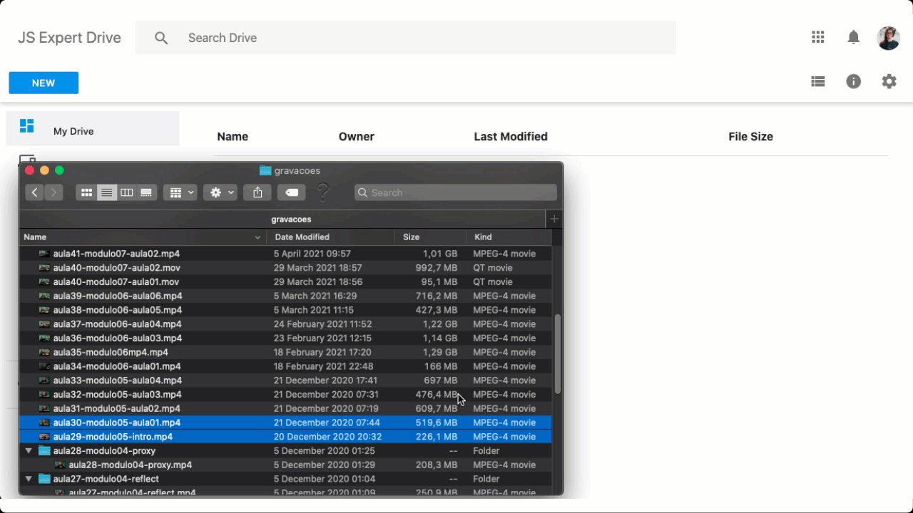

# Google Drive Clone

## 💻 Projeto

O Google Drive é um serviço de armazenamento e sincronização de arquivos desenvolvido pelo Google. O Google Drive permite que os usuários armazenem arquivos na nuvem, sincronizem arquivos entre dispositivos e compartilhem arquivos.

Esse projeto foi desenvolvido durante a quinta edição da Semana JS Expert. O projeto foi desenvolvido com o objetivo de apresentar ao público um poderoso sistema de armazenamento e sincronização de arquivos.

## 🔶 Preview

## ☑️ Checklist Features

- Web API
    - Lista arquivos baixados
    - Recebe stream de arquivos e salva em disco 
    - Notifica sobre progresso de armazenamento de arquivos em disco 
    - Permiti upload de arquivos em formato image, video ou audio
    - 100% de cobertura de código em testes

- Web App 
    - Lista arquivos baixados
    - Realiza upload de arquivos de qualquer tamanho
    - Upload de arquivos via botão
    - Exibe progresso de upload 
    - Upload via drag and drop

## Créditos ao Layout <3

- O Layout foi adaptado a partir do projeto do brasileiro [Leonardo Santo](https://github.com/leoespsanto) disponibilizado no [codepen](https://codepen.io/leoespsanto/pen/KZMMKG).